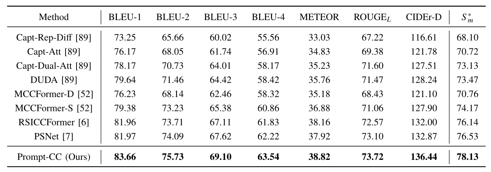

<div align="center">

<h1><a href="https://ieeexplore.ieee.org/document/10271701">A Decoupling Paradigm with Prompt Learning for Remote Sensing Image Change Captioning</a></h1>

**[Chenyang Liu](https://chen-yang-liu.github.io/), [Rui Zhao](https://ruizhaocv.github.io), [Jianqi Chen](https://windvchen.github.io/), [Zipeng Qi](https://scholar.google.com/citations?user=KhMtmBsAAAAJ), [Zhengxia Zou](https://scholar.google.com.hk/citations?hl=en&user=DzwoyZsAAAAJ), and [Zhenwei Shi*✉](https://scholar.google.com.hk/citations?hl=en&user=kNhFWQIAAAAJ)**


</div>

## Welcome to our repository! 

This repository contains the PyTorch implementation of our PromptCC model.

## Overview
- Considering the specificity of the RSICC task, PromptCC employs a novel decoupling paradigm and deeply integrates prompt learning and pre-trained large language models.
- This repository will encompass all aspects of our code, including **training, inference, computation of evaluation metrics, as well as the tokenization and word mapping** used in our work.

<div align="center">
</img>
</div>

[//]: # (## Contributions)

[//]: # (- **Decoupling Paradigm**: The previous methods predominantly adhere to the encoder-decoder framework directly borrowed from the image captioning field, overlooking the specificity of the RSICC task. Unlike that, we propose a decoupling paradigm to decouple the RSICC task into two issues: whether and what changes have occurred. Specifically, we propose a pure Transformer-based model in which an image-level classifier and a feature-level encoder are employed to address the above two issues. The experiments validate the effectiveness of our approach. Furthermore, in Section IV-G, we discuss the advantages of our decoupling paradigm to demonstrate that the new paradigm has a broad prospect and is more proper than the previous coupled paradigm for the RSICC task.)

[//]: # (- **Integration of prompt learning and pre-trained large language models**: To our knowledge, we are the **first** to introduce prompt learning and the LLM into the RSICC task. To fully exploit their potential in the RSICC task, we propose a multi-prompt learning strategy which can effectively exploit the powerful abilities of the pre-trained LLM, and prompt the LLM to know whether changes exist and generate captions. Unlike the previous methods, our method can generate plausible captions without retraining a language decoder from scratch as the caption generator. Lastly, with the recent emergence of various LLMs, we believe that LLMs will attract broader attention in the remote sensing community in the forthcoming years. We aspire for our paper to inspire future advancements in remote sensing research.)

[//]: # (- **Experiments**: Experiments show that our decoupling paradigm and the multi-prompt learning strategy are effective and our model achieves SOTA performance with a significant improvement. Besides, an additional experiment demonstrates our decoupling paradigm is more proper than the previous coupled paradigm for the RSICC task.)


### Installation and Dependencies
```python
git clone https://github.com/Chen-Yang-Liu/PromptCC.git
cd PromptCC
conda create -n PromptCC_env python=3.9
conda activate PromptCC_env
pip install -r requirements.txt
```

### Data preparation
Firstly, download the image pairs of LEVIR_CC dataset from the [[Repository](https://github.com/Chen-Yang-Liu/RSICC)]. Extract images pairs and put them in `./data/LEVIR_CC/` as follows:
```python
.data/LEVIR_CC:
                ├─LevirCCcaptions_v1.json (one new json file with changeflag, different from the old version from the above Download link)
                ├─images
                  ├─train
                  │  ├─A
                  │  ├─B
                  ├─val
                  │  ├─A
                  │  ├─B
                  ├─test
                  │  ├─A
                  │  ├─B
```

Then preprocess dataset as follows:
```python
python create_input_files.py
```
After that, you can find some resulted `.pkl` files in `./data/LEVIR_CC/`. 
Of course, you can use our provided resulted `.pkl` files directly in [[Hugging face](https://huggingface.co/lcybuaa/PromptCC/tree/main)].

### Inference Demo
You can download our pretrained model here: [[Hugging face](https://huggingface.co/lcybuaa/PromptCC/tree/main)]

After downloaded the model, put `cls_model.pth.tar` in `./checkpoints/classification_model/` and put `BEST_checkpoint_ViT-B_32.pth.tar` in `./checkpoints/cap_model/`.

Then, run a demo to get started as follows:
```python
python caption_beams.py
```

### Train
Make sure you performed the data preparation above. Then, start training as follows:
```python
python train.py
```

### Evaluate
```python
python eval2.py
```
Note: 
- It's important to note that, before model training and evaluation, a sentence needs to undergo tokenization and mapping of words to indices. For instance, in the case of the word “difference”, GPT would tokenize it as ['diff', 'erence'] using its subword-based tokenization mechanism and map them to [26069, 1945] using its word mapping.  Different tokenization and word mapping will influence the scores of the evaluation metrics. Therefore, to ensure a fair performance comparison, it is essential to utilize the same tokenization and word mapping when calculating evaluation metrics for all comparison methods.
- For all comparison methods, we have retrained and evaluated model performance using the publicly available  **<font color="#000000">tokenizer and word mapping of GPT</font>**, which are more comprehensive and widely acknowledged. We also recommend that future researchers follow this.
- Comparison with SOTA: 
<div align="center">
</img>
</div>

## Citation & Acknowledgments
If you find this paper useful in your research, please consider citing:
```
@ARTICLE{10271701,
  author={Liu, Chenyang and Zhao, Rui and Chen, Jianqi and Qi, Zipeng and Zou, Zhengxia and Shi, Zhenwei},
  journal={IEEE Transactions on Geoscience and Remote Sensing}, 
  title={A Decoupling Paradigm With Prompt Learning for Remote Sensing Image Change Captioning}, 
  year={2023},
  volume={61},
  number={},
  pages={1-18},
  doi={10.1109/TGRS.2023.3321752}}
```
